# OrbitDB-Orchestrated P2P Inference Swarm — Implementation Plan

> **Audience**: Team of 20 developers working in parallel.
> **Stack**: TypeScript (ESM) · OrbitDB v3 · Helia v6 · libp2p · Ollama REST API
> **Branching**: Each workstream → `automation/feature/<id>`, merge → `automation/development`, final → `main`

---

## Table of Contents
1. [System Architecture](#1-system-architecture)
2. [Shared Contracts (Interfaces & Types)](#2-shared-contracts)
3. [Workstreams](#3-workstreams)
4. [Dependency Graph](#4-dependency-graph)
5. [Data Model](#5-data-model)
6. [API Reference (Internal)](#6-api-reference)
7. [Verification Matrix](#7-verification-matrix)

---

## 1. System Architecture


### Design Principles
- **KISS**: Each module does one thing.
- **DRY**: Shared types in `src/types/`, shared utils in `src/utils/`.
- **YAGNI**: No external library if not necessary; only what is required.
- **Builder Pattern**: All managers use fluent builder APIs.
- **Dependency Injection**: All deps passed via constructor/factory params.
- **TDD**: Write test → red → implement → green → refactor.

---

## 2. Shared Contracts

> **CRITICAL**: This section must be implemented **FIRST** (Workstream 0). All other workstreams depend on it.

### File: `src/types/index.ts`

```typescript
// ── Task Lifecycle ──────────────────────────────────────────
export enum TaskStatus {
  PENDING   = 'PENDING',    // Created, waiting for a worker
  CLAIMED   = 'CLAIMED',    // Worker has claimed it
  RUNNING   = 'RUNNING',    // Inference in progress
  COMPLETED = 'COMPLETED',  // Result available
  FAILED    = 'FAILED',     // Error occurred
  CANCELLED = 'CANCELLED',  // Requester cancelled
}

export interface InferenceTask {
  _id: string;                // UUID v4 — OrbitDB Documents indexBy field
  prompt: string;             // The user prompt (may be encrypted)
  model: string;              // Ollama model name, e.g. 'tinyllama'
  status: TaskStatus;
  requesterPeerId: string;    // PeerId of the node that created the task
  workerPeerId?: string;      // PeerId of the node processing the task
  createdAt: number;          // Unix ms timestamp
  claimedAt?: number;
  completedAt?: number;
  options?: OllamaOptions;    // Temperature, top_p, etc.
  encrypted?: boolean;        // Whether prompt/result are encrypted
  parentTaskId?: string;      // If this is a chunk of a larger task
  chunkIndex?: number;        // Position in the chunk sequence
  totalChunks?: number;       // Total chunks for the parent task
}

export interface InferenceResult {
  _id: string;                // Same UUID as the task
  taskId: string;             // Reference to InferenceTask._id
  response: string;           // The LLM response (may be encrypted)
  model: string;
  workerPeerId: string;
  totalDurationNs?: number;   // From Ollama response
  evalCount?: number;         // Tokens generated
  promptEvalCount?: number;   // Tokens in prompt
  completedAt: number;
  error?: string;             // If status is FAILED
}

// ── Ollama ──────────────────────────────────────────────────
export interface OllamaOptions {
  temperature?: number;
  top_p?: number;
  top_k?: number;
  num_predict?: number;
  stop?: string[];
}

export interface OllamaGenerateRequest {
  model: string;
  prompt: string;
  stream: false;              // Always non-streaming for v1
  options?: OllamaOptions;
  system?: string;
  format?: 'json';
}

export interface OllamaGenerateResponse {
  model: string;
  response: string;
  done: boolean;
  total_duration: number;
  eval_count: number;
  prompt_eval_count: number;
}

export interface OllamaModelInfo {
  name: string;
  size: number;
  digest: string;
  modified_at: string;
}

// ── Crypto ──────────────────────────────────────────────────
export interface EncryptionModule {
  replication: { encrypt: (data: Uint8Array) => Promise<Uint8Array>; decrypt: (data: Uint8Array) => Promise<Uint8Array> };
  data: { encrypt: (data: Uint8Array) => Promise<Uint8Array>; decrypt: (data: Uint8Array) => Promise<Uint8Array> };
}

export interface KeyPair {
  publicKey: string;   // Base64-encoded
  privateKey: string;  // Base64-encoded
}

// ── Config ──────────────────────────────────────────────────
export interface NodeConfig {
  nodeId?: string;
  ollamaHost: string;
  ollamaPort: number;
  orbitDbDirectory: string;
  bootstrapPeers: string[];   // Multiaddrs
  listenAddresses: string[];  // e.g. ['/ip4/0.0.0.0/tcp/0']
  models: string[];           // Models this node can serve
  maxConcurrentTasks: number;
  logLevel: 'debug' | 'info' | 'warn' | 'error';
}

// ── Events (internal pub/sub) ───────────────────────────────
export interface SwarmEvents {
  'task:created':   (task: InferenceTask) => void;
  'task:claimed':   (task: InferenceTask) => void;
  'task:completed': (task: InferenceTask, result: InferenceResult) => void;
  'task:failed':    (task: InferenceTask, error: Error) => void;
  'peer:joined':    (peerId: string) => void;
  'peer:left':      (peerId: string) => void;
}
```

---

## 3. Workstreams

Each workstream is **independent** and can be developed in parallel. Dependencies between workstreams are resolved through the shared contracts above and mock implementations.

---

### WS-0: Shared Types & Project Skeleton
| Field | Value |
|---|---|
| **Branch** | `automation/feature/ws0-types` |
| **Owner** | Dev 1 |
| **Depends on** | Nothing |
| **Blocks** | All other workstreams |
| **Estimated effort** | 2h |

#### Tasks
1. Create `src/types/index.ts` with all interfaces above
2. Create `src/utils/logger.ts` — Winston logger with configurable level
3. Create `src/utils/uuid.ts` — UUID v4 generator wrapper
4. Create `src/utils/timestamp.ts` — `Date.now()` wrapper (testable)
5. Create test stubs: ensure types compile, logger writes to stdout

#### Logger Contract
```typescript
// src/utils/logger.ts
import winston from 'winston';

export const createLogger = (level: string = 'info', label?: string): winston.Logger => {
  return winston.createLogger({
    level,
    format: winston.format.combine(
      winston.format.label({ label: label || 'swarm' }),
      winston.format.timestamp(),
      winston.format.printf(({ timestamp, level, label, message, ...meta }) =>
        `${timestamp} [${label}] ${level}: ${message} ${Object.keys(meta).length ? JSON.stringify(meta) : ''}`
      )
    ),
    transports: [new winston.transports.Console()],
  });
};
```

#### Acceptance
- `npm run build` succeeds
- `npm test -- --testPathPattern=types` passes

---

### WS-1: OllamaClient
| Field | Value |
|---|---|
| **Branch** | `automation/feature/ws1-ollama-client` |
| **Owner** | Dev 2–3 |
| **Depends on** | WS-0 (types) |
| **Blocks** | WS-5 (Worker) |
| **Estimated effort** | 4h |

#### File: `src/llm/OllamaClient.ts`

##### Builder API
```typescript
class OllamaClientBuilder {
  private host = '127.0.0.1';
  private port = 11434;
  private timeout = 120_000; // ms
  private retryAttempts = 3;
  private retryDelay = 1000; // ms

  withHost(host: string): this;
  withPort(port: number): this;
  withTimeout(ms: number): this;
  withRetry(attempts: number, delayMs: number): this;
  build(): OllamaClient;
}
```

##### Public Methods
| Method | Signature | Description |
|---|---|---|
| `generate` | `(req: OllamaGenerateRequest) => Promise<OllamaGenerateResponse>` | Sends POST `/api/generate` |
| `listModels` | `() => Promise<OllamaModelInfo[]>` | GET `/api/tags` |
| `isAvailable` | `() => Promise<boolean>` | GET `/` — returns true if 200 |
| `hasModel` | `(name: string) => Promise<boolean>` | Checks if model is in `listModels()` |
| `pullModel` | `(name: string) => Promise<void>` | POST `/api/pull` |

##### Tests (TDD — write FIRST)
| Test file | Test | Mock strategy |
|---|---|---|
| `__tests__/llm/OllamaClient.test.ts` | `should build with defaults` | No mock |
| | `should return response for valid prompt` | HTTP mock (nock/msw) |
| | `should retry on connection error` | HTTP mock returns ECONNREFUSED then 200 |
| | `should timeout after configured ms` | HTTP mock with delayed response |
| | `should list available models` | HTTP mock |
| | `should report unavailable when server is down` | HTTP mock |
| | `should throw on invalid model` | HTTP mock returns 404 |

##### Implementation Details
- Use Node.js native `http` module (no axios — KISS)
- Retry with exponential backoff: `delay * 2^attempt`
- All errors wrapped in custom `OllamaError` class
- Log every request at `debug` level, errors at `error` level

---

### WS-2: OrbitDbManager
| Field | Value |
|---|---|
| **Branch** | `automation/feature/ws2-orbitdb-manager` |
| **Owner** | Dev 4–6 |
| **Depends on** | WS-0 (types) |
| **Blocks** | WS-4 (TaskStore), WS-6 (Orchestrator) |
| **Estimated effort** | 8h |

#### File: `src/core/OrbitDbManager.ts`

##### Builder API
```typescript
class OrbitDbManagerBuilder {
  private directory = './orbitdb';
  private listenAddresses = ['/ip4/0.0.0.0/tcp/0'];
  private bootstrapPeers: string[] = [];

  withDirectory(dir: string): this;
  withListenAddresses(addrs: string[]): this;
  withBootstrapPeers(peers: string[]): this;
  build(): Promise<OrbitDbManager>;
}
```

##### Public Methods
| Method | Signature | Description |
|---|---|---|
| `getPeerId` | `() => string` | Returns this node's PeerId |
| `openDocumentsDb` | `(name: string, indexBy?: string) => Promise<DocumentsDB>` | Opens/creates a Documents DB |
| `openEventsDb` | `(name: string) => Promise<EventsDB>` | Opens/creates an Events DB |
| `openKeyValueDb` | `(name: string) => Promise<KeyValueDB>` | Opens/creates a KeyValue DB |
| `getDbAddress` | `(db: any) => string` | Returns canonical OrbitDB address |
| `stop` | `() => Promise<void>` | Graceful shutdown: close all DBs, stop Helia |

##### Internal: Helia + libp2p Setup
```typescript
// Inside build():
import { createHelia } from 'helia';
import { createLibp2p } from 'libp2p';
import { tcp } from '@libp2p/tcp';
import { noise } from '@chainsafe/libp2p-noise';
import { yamux } from '@libp2p/yamux';
import { gossipsub } from '@chainsafe/libp2p-gossipsub';
import { identify } from '@libp2p/identify';
import { bootstrap } from '@libp2p/bootstrap';

const libp2p = await createLibp2p({
  addresses: { listen: this.listenAddresses },
  transports: [tcp()],
  connectionEncrypters: [noise()],
  streamMuxers: [yamux()],
  peerDiscovery: this.bootstrapPeers.length > 0 ? [bootstrap({ list: this.bootstrapPeers })] : [],
  services: {
    pubsub: gossipsub({ allowPublishToZeroTopicPeers: true }),
    identify: identify(),
  },
});
const ipfs = await createHelia({ libp2p });
```

##### Tests (TDD)
| Test file | Test |
|---|---|
| `__tests__/core/OrbitDbManager.test.ts` | `should create an instance with default config` |
| | `should return a valid peerId` |
| | `should open a Documents database` |
| | `should open an Events database` |
| | `should write and read from Documents DB` |
| | `should sync between two in-process nodes` |
| | `should stop gracefully without hanging` |

##### Critical Notes
- Each test must create its own temporary directory (use `os.tmpdir()`)
- Each test must call `manager.stop()` in `afterEach` — otherwise libp2p hangs
- Sync test: create 2 OrbitDbManagers, connect them via bootstrap, write on A, verify read on B
- Use `{ syncAutomatically: true }` when opening DBs for sync tests

---

### WS-3: CryptoManager
| Field | Value |
|---|---|
| **Branch** | `automation/feature/ws3-crypto` |
| **Owner** | Dev 7–8 |
| **Depends on** | WS-0 (types) |
| **Blocks** | WS-4 (TaskStore — optional encryption), WS-6 (Orchestrator) |
| **Estimated effort** | 4h |

#### File: `src/crypto/CryptoManager.ts`

##### Public Methods
| Method | Signature | Description |
|---|---|---|
| `generateKeyPair` | `() => Promise<KeyPair>` | ED25519 via Node.js `crypto` |
| `encrypt` | `(plaintext: string, publicKey: string) => Promise<string>` | Hybrid: ECDH + AES-256-GCM |
| `decrypt` | `(ciphertext: string, privateKey: string) => Promise<string>` | Reverse of encrypt |
| `createEncryptionModule` | `(keyPair: KeyPair) => EncryptionModule` | Returns OrbitDB-compatible encrypt/decrypt |
| `sign` | `(data: string, privateKey: string) => Promise<string>` | ED25519 signature |
| `verify` | `(data: string, signature: string, publicKey: string) => Promise<boolean>` | Signature verification |

##### Tests (TDD)
| Test | Description |
|---|---|
| `should generate a valid key pair` | Keys are base64, correct length |
| `should encrypt and decrypt a string` | Roundtrip |
| `should fail decryption with wrong key` | Throws error |
| `should produce different ciphertext for same plaintext` | Due to random IV |
| `should sign and verify data` | Roundtrip |
| `should reject invalid signature` | Returns false |
| `should produce OrbitDB-compatible EncryptionModule` | Roundtrip with Uint8Array |

##### Implementation: Use Node.js `crypto` only (no external deps)
```typescript
import { generateKeyPairSync, createCipheriv, createDecipheriv, randomBytes, sign, verify } from 'crypto';
```

---

### WS-4: TaskStore (OrbitDB Abstraction)
| Field | Value |
|---|---|
| **Branch** | `automation/feature/ws4-task-store` |
| **Owner** | Dev 9–11 |
| **Depends on** | WS-0, WS-2 (OrbitDbManager) |
| **Blocks** | WS-5 (Worker), WS-6 (Orchestrator) |
| **Estimated effort** | 6h |

#### File: `src/store/TaskStore.ts`

This module wraps OrbitDB Documents DB to provide a typed, domain-specific API for tasks and results.

##### Constructor (DI)
```typescript
class TaskStore {
  constructor(
    private orbitDbManager: OrbitDbManager,
    private logger: winston.Logger,
    private cryptoManager?: CryptoManager
  ) {}
}
```

##### Public Methods
| Method | Signature | Description |
|---|---|---|
| `initialize` | `() => Promise<void>` | Opens `tasks` and `results` DBs |
| `createTask` | `(task: Omit<InferenceTask, '_id' \| 'createdAt'>) => Promise<InferenceTask>` | Adds to tasks DB |
| `claimTask` | `(taskId: string, workerPeerId: string) => Promise<InferenceTask>` | Atomic claim (optimistic) |
| `completeTask` | `(taskId: string, result: Omit<InferenceResult, '_id' \| 'completedAt'>) => Promise<void>` | Updates task + writes result |
| `failTask` | `(taskId: string, error: string) => Promise<void>` | Sets status FAILED |
| `getTask` | `(taskId: string) => Promise<InferenceTask \| null>` | Lookup by ID |
| `getResult` | `(taskId: string) => Promise<InferenceResult \| null>` | Lookup by task ID |
| `getPendingTasks` | `() => Promise<InferenceTask[]>` | Query status=PENDING |
| `getTasksByRequester` | `(peerId: string) => Promise<InferenceTask[]>` | All tasks from a requester |
| `onTaskUpdate` | `(callback: (task: InferenceTask) => void) => void` | Subscribe to DB updates |
| `close` | `() => Promise<void>` | Close underlying DBs |

##### OrbitDB Internals
- **Tasks DB**: `orbitdb.open('swarm-tasks', { type: 'documents' })` — indexed by `_id`
- **Results DB**: `orbitdb.open('swarm-results', { type: 'documents' })` — indexed by `_id`
- **Conflict resolution**: Last-write-wins (CRDT default). For `claimTask`, use optimistic locking: read → check status=PENDING → write CLAIMED. If two workers claim simultaneously, both write; the Orchestrator resolves by checking `claimedAt` timestamp.

##### Tests (TDD)
| Test | Mock strategy |
|---|---|
| `should create a task with auto-generated ID and timestamp` | Real OrbitDB (in-memory) |
| `should claim a PENDING task` | Real OrbitDB |
| `should reject claiming an already CLAIMED task` | Real OrbitDB |
| `should complete a task and store result` | Real OrbitDB |
| `should query pending tasks` | Real OrbitDB with 5 tasks |
| `should emit update event when remote task appears` | Two-node sync |
| `should encrypt task content when CryptoManager provided` | Mock crypto |

---

### WS-5: Worker (Task Consumer + Inference Engine)
| Field | Value |
|---|---|
| **Branch** | `automation/feature/ws5-worker` |
| **Owner** | Dev 12–14 |
| **Depends on** | WS-0, WS-1 (OllamaClient), WS-4 (TaskStore) |
| **Blocks** | WS-7 (Integration) |
| **Estimated effort** | 6h |

#### File: `src/swarm/Worker.ts`

##### Constructor (DI)
```typescript
class Worker {
  constructor(
    private taskStore: TaskStore,
    private ollamaClient: OllamaClient,
    private logger: winston.Logger,
    private config: { peerId: string; models: string[]; maxConcurrent: number }
  ) {}
}
```

##### Public Methods
| Method | Signature | Description |
|---|---|---|
| `start` | `() => void` | Begin polling / listening for tasks |
| `stop` | `() => void` | Stop accepting new tasks, wait for current |
| `getActiveTaskCount` | `() => number` | Number of currently processing tasks |

##### Internal Flow
```
1. Listen for TaskStore 'update' events
2. Filter: status=PENDING AND model in this.config.models
3. Attempt claimTask(taskId, peerId)
4. If claim succeeds:
   a. Update status → RUNNING
   b. Call ollamaClient.generate({ model, prompt, stream: false })
   c. On success → taskStore.completeTask(taskId, result)
   d. On error → taskStore.failTask(taskId, error.message)
5. Respect maxConcurrent limit (use semaphore/PQueue)
```

##### Tests (TDD)
| Test | Mock strategy |
|---|---|
| `should pick up a PENDING task matching its models` | Mock TaskStore + Mock OllamaClient |
| `should ignore tasks for models it doesn't serve` | Mock TaskStore |
| `should not exceed maxConcurrent tasks` | Mock with delayed responses |
| `should mark task COMPLETED on success` | Mock OllamaClient returns response |
| `should mark task FAILED on Ollama error` | Mock OllamaClient throws |
| `should stop gracefully mid-task` | Mock with slow OllamaClient |

---

### WS-6: SwarmOrchestrator (Task Producer + Aggregator)
| Field | Value |
|---|---|
| **Branch** | `automation/feature/ws6-orchestrator` |
| **Owner** | Dev 15–17 |
| **Depends on** | WS-0, WS-3 (CryptoManager), WS-4 (TaskStore) |
| **Blocks** | WS-7 (Integration) |
| **Estimated effort** | 8h |

#### File: `src/swarm/SwarmOrchestrator.ts`

##### Constructor (DI)
```typescript
class SwarmOrchestrator {
  constructor(
    private taskStore: TaskStore,
    private cryptoManager: CryptoManager,
    private logger: winston.Logger,
    private config: { peerId: string; defaultModel: string }
  ) {}
}
```

##### Public Methods
| Method | Signature | Description |
|---|---|---|
| `submitPrompt` | `(prompt: string, opts?: SubmitOptions) => Promise<string>` | Returns parentTaskId |
| `getStatus` | `(taskId: string) => Promise<TaskStatusReport>` | Status + progress |
| `getResult` | `(taskId: string) => Promise<string>` | Aggregated result (waits) |
| `cancelTask` | `(taskId: string) => Promise<void>` | Cancel pending chunks |

##### SubmitOptions
```typescript
interface SubmitOptions {
  model?: string;
  chunkStrategy?: 'none' | 'split-by-paragraph' | 'split-by-size';
  maxChunkSize?: number;     // characters
  encrypt?: boolean;
}
```

##### Chunking Logic
```
IF chunkStrategy === 'none' OR prompt.length < maxChunkSize:
  → Create 1 InferenceTask
ELSE IF chunkStrategy === 'split-by-paragraph':
  → Split by '\n\n', group into chunks ≤ maxChunkSize
ELSE IF chunkStrategy === 'split-by-size':
  → Split at word boundaries every maxChunkSize chars

Each chunk → InferenceTask with parentTaskId, chunkIndex, totalChunks
```

##### Result Aggregation
```
Poll/listen for all chunks with parentTaskId
When all chunks have status=COMPLETED:
  → Concatenate results in chunkIndex order
  → Return aggregated response
If any chunk FAILED:
  → Mark parent as FAILED
```

##### Tests (TDD)
| Test | Mock strategy |
|---|---|
| `should submit a single-chunk task` | Mock TaskStore |
| `should split prompt into N chunks` | No mock (pure logic) |
| `should respect word boundaries in split-by-size` | No mock |
| `should aggregate results in correct order` | Mock TaskStore with results |
| `should report FAILED if any chunk fails` | Mock TaskStore |
| `should encrypt prompt when flag is set` | Mock CryptoManager |
| `should cancel all pending chunks` | Mock TaskStore |

---

### WS-7: Node Bootstrap & CLI
| Field | Value |
|---|---|
| **Branch** | `automation/feature/ws7-cli` |
| **Owner** | Dev 18–19 |
| **Depends on** | WS-1, WS-2, WS-3, WS-4, WS-5, WS-6 |
| **Blocks** | Nothing (final assembly) |
| **Estimated effort** | 4h |

#### File: `src/node/SwarmNode.ts`

##### Role
Composes all modules into a running node. A single node can act as **both** Producer and Consumer.

```typescript
class SwarmNode {
  static async create(config: NodeConfig): Promise<SwarmNode>;
  async submitPrompt(prompt: string, opts?: SubmitOptions): Promise<string>;
  async getResult(taskId: string): Promise<string>;
  async shutdown(): Promise<void>;
}
```

##### Internal Wiring
```typescript
// Inside SwarmNode.create():
const logger = createLogger(config.logLevel, config.nodeId);
const orbitDb = await new OrbitDbManagerBuilder()
    .withDirectory(config.orbitDbDirectory)
    .withListenAddresses(config.listenAddresses)
    .withBootstrapPeers(config.bootstrapPeers)
    .build();
const ollama = new OllamaClientBuilder()
    .withHost(config.ollamaHost)
    .withPort(config.ollamaPort)
    .build();
const crypto = new CryptoManager();
const taskStore = new TaskStore(orbitDb, logger, crypto);
await taskStore.initialize();
const worker = new Worker(taskStore, ollama, logger, {
    peerId: orbitDb.getPeerId(),
    models: config.models,
    maxConcurrent: config.maxConcurrentTasks,
});
const orchestrator = new SwarmOrchestrator(taskStore, crypto, logger, {
    peerId: orbitDb.getPeerId(),
    defaultModel: config.models[0],
});
worker.start();
```

#### File: `src/cli.ts`

```
Usage:
  swarm start [--config config.json]       Start a swarm node
  swarm submit "prompt text" [--model m]   Submit inference task
  swarm status <taskId>                    Check task status
  swarm result <taskId>                    Get result
```

Implementation: Use `process.argv` parsing (no external CLI lib — YAGNI).

##### Tests
| Test | Description |
|---|---|
| `should create a SwarmNode with valid config` | Integration test |
| `should submit and complete a task on single node` | Self-dispatch test |

---

### WS-8: Integration & E2E Testing
| Field | Value |
|---|---|
| **Branch** | `automation/feature/ws8-e2e` |
| **Owner** | Dev 20 |
| **Depends on** | All workstreams |
| **Blocks** | Release |
| **Estimated effort** | 8h |

#### Test Scenarios

| # | Test | Setup | Assert |
|---|---|---|---|
| 1 | **Single-node self-dispatch** | 1 SwarmNode, mock Ollama | Submit → complete → result matches mock |
| 2 | **Two-node inference** | Node A (producer), Node B (worker), mock Ollama on B | A submits → B claims → B completes → A gets result |
| 3 | **Chunked prompt** | 1 SwarmNode, large prompt, mock Ollama | 3 chunks created → 3 results → aggregated correctly |
| 4 | **Encrypted task** | 2 SwarmNodes, encryption enabled | Only designated worker can decrypt |
| 5 | **Worker failure recovery** | Worker crashes mid-task | Task returns to PENDING after timeout (future: WS-9) |
| 6 | **Real Ollama** | 1 SwarmNode, `tinyllama` model | Full roundtrip with actual LLM response |

---

## 4. Dependency Graph


**Parallel execution**: After WS-0, workstreams WS-1, WS-2, WS-3 run **fully in parallel**. WS-4 starts when WS-2 is done. WS-5 and WS-6 run in parallel once WS-4 is done. WS-7 and WS-8 are sequential at the end.

---

## 5. Data Model

### OrbitDB Databases

| DB Name | Type | Index | Content |
|---|---|---|---|
| `swarm-tasks` | Documents | `_id` | `InferenceTask` objects |
| `swarm-results` | Documents | `_id` | `InferenceResult` objects |
| `swarm-events` | Events | — | Audit log (task lifecycle events) |

### OrbitDB API Cheatsheet (from v3.0.2 source)

```typescript
// Open
const db = await orbitdb.open('swarm-tasks', { type: 'documents', sync: true });

// Write
await db.put({ _id: 'uuid', prompt: '...', status: 'PENDING', ... });

// Read by key
const doc = await db.get('uuid');  // Returns { hash, key, value }

// Query (full scan — use sparingly)
const pending = await db.query(doc => doc.status === 'PENDING');

// Listen for updates (from remote peers)
db.events.on('update', (entry) => {
  const { op, key, value } = entry.payload;
  // op: 'PUT' | 'DEL', key: '_id value', value: document
});

// Sync events
db.events.on('join', (peerId, heads) => { /* peer connected */ });
db.events.on('leave', (peerId) => { /* peer disconnected */ });
```

---

## 6. API Reference (Internal)

### Ollama REST API (localhost:11434)

| Endpoint | Method | Body | Response |
|---|---|---|---|
| `/` | GET | — | `Ollama is running` (200) |
| `/api/tags` | GET | — | `{ models: OllamaModelInfo[] }` |
| `/api/generate` | POST | `OllamaGenerateRequest` | `OllamaGenerateResponse` |
| `/api/pull` | POST | `{ name: string }` | Stream of progress |

---

## 7. Verification Matrix

| Phase | What | Who | How | Pass Criteria |
|---|---|---|---|---|
| Unit | Each module | WS owner | `npm test -- --testPathPattern=<module>` | All green |
| Integration | OrbitDB sync | WS-2 | 2-node in-process test | Data replicates in < 5s |
| Integration | TaskStore + OrbitDB | WS-4 | Real OrbitDB, typed operations | CRUD + query works |
| E2E | Single node | WS-8 | Mock Ollama | Full lifecycle |
| E2E | Multi node | WS-8 | 2 processes, mock Ollama | Cross-node task completion |
| E2E | Real LLM | WS-8 | `tinyllama` | Actual response within 30s |
| Performance | Throughput | WS-8 | 100 tasks, 2 workers | All complete in < 60s |

---

## Appendix: Git Workflow

```bash
# Start a workstream
git checkout automation/development
git checkout -b automation/feature/ws1-ollama-client

# Commit often with descriptive messages
git commit -m "feat(ws1): add OllamaClient builder with host/port config"
git commit -m "test(ws1): add unit tests for generate endpoint"
git commit -m "feat(ws1): implement retry with exponential backoff"

# When complete, merge to development
git checkout automation/development
git merge automation/feature/ws1-ollama-client

# After all WSs merged and E2E passes
git checkout main
git merge automation/development
```

---

## Performance Optimization: Rapidsnark ZK Prover

> **Branch**: `automation/feature/rapidsnark-prover`
> **Goal**: Migrate ZK proof generation from snarkjs (pure JS, ~550ms) to rapidsnark (C++ native, ~15ms) for ~35x speedup.

### Architecture

```
snarkjs.groth16.fullProve() → split into:
  1. snarkjs.wtns.calculate()    → witness.wtns  (~10ms, WASM)
  2. rapidsnark prover binary    → proof.json    (~15ms, C++)
  ──────────────────────────────
  Total: ~25ms vs ~550ms (22x faster)
```

### Changes

| File | Action | Description |
|------|--------|-------------|
| `src/crypto/ZkInferenceProver.ts` | MODIFY | Add `rapidsnark` backend: split witness gen + proof gen, fallback to snarkjs |
| `Dockerfile` | MODIFY | Multi-stage build for rapidsnark C++ binary |
| `scripts/build-rapidsnark.sh` | NEW | Local build script for macOS/Linux |
| `__tests__/crypto/ZkRapidsnark.test.ts` | NEW | Benchmark + cross-verification test |

### Dependencies

- `cmake`, `g++`, `libgmp-dev`, `libsodium-dev`, `nasm` (build-time only)
- No new npm packages — rapidsnark is a standalone binary

### Verification

- [ ] Rapidsnark proof < 50ms (benchmark test)
- [ ] Rapidsnark proof verifiable by existing snarkjs verifier
- [ ] Graceful fallback to snarkjs if binary not found
- [ ] 133/133 existing tests still pass

---

## Phase 2: 100% Browser-Native Distributed Supercomputer ✅

> **Status**: Implemented + 61 tests passing.
> **Branch**: `automation/feature/p2-browser-supercomputer` (merged to `automation/development`)
> **Goal**: Every browser tab is a full node — zero servers. WASM core for crypto, MetaMask-first wallet, model sharding pipeline, governance, testnet faucet.

### P2 Deliverables

| WS | Module | What | Tests |
|----|--------|------|-------|
| **WS1** | `browser/cdi-wasm/` | Rust→WASM crate: Ed25519 wallet, tx signing, tokenomics | 23 |
| **WS1** | `browser/cdi-node.js` | Browser node runtime: WASM init, MetaMask EIP-712, wallet persistence | — |
| **WS1** | `browser/index.html` | Premium dark UI with MetaMask-first connect flow + dashboard | — |
| **WS2** | `browser/sharding/ShardRegistry.js` | Shard manifest management, claim/release, heartbeat, eviction | 9 |
| **WS2** | `browser/sharding/PipelineOrchestrator.js` | Pipeline build, sequential execution, failover, proportional rewards | 7 |
| **WS3** | `browser/governance/GovernanceStore.js` | Proposal lifecycle: submit → vote → quorum (51%) → timelock → execute | 8 |
| **WS3** | `browser/governance/Proposal.js` | Stake-weighted voting, tally, state transitions | 7 |
| **WS4** | `browser/testnet/TestnetFaucet.js` | 4 reward types (10+50+20+20=100 CDI/node), testnet guard | 7 |

### P2 Architecture

```mermaid
graph TB
    subgraph "Browser Node (every tab = full node)"
        WASM["CDI WASM Core<br/>(Rust → WASM 200KB)<br/>wallet, signing, tokenomics"]
        WebGPU["WebGPU Compute<br/>[P3: ShardExecutor]"]
        Wallet["MetaMask Bridge<br/>EIP-712 binding"]
        ShardReg["ShardRegistry<br/>manifest + assignments"]
        Pipeline["PipelineOrchestrator<br/>failover + rewards"]
        Gov["GovernanceStore<br/>proposals + voting"]
        Faucet["TestnetFaucet<br/>100 CDI airdrop"]
    end
```



---

## Phase 3: Real P2P + WebGPU Integration 🔶

> **Status**: Not started.
> **Goal**: Wire up the P2 modules with real libp2p WebRTC transport, Helia IPFS, OrbitDB persistence, and WebGPU compute. This turns the mock-ready P2 code into a functional distributed network.

### WS-P3.1: libp2p WebRTC Browser P2P

| Field | Value |
|---|---|
| **Branch** | `automation/feature/p3-libp2p-webrtc` |
| **Depends on** | P2 WS1 (browser node) |
| **Estimated effort** | 8h |

#### Components

##### [MODIFY] `browser/cdi-node.js`
- Import `@libp2p/webrtc`, `@libp2p/circuit-relay-v2`, `@chainsafe/libp2p-gossipsub`
- Configure libp2p node with WebRTC transport + Circuit Relay v2
- Auto-discover peers via GossipSub
- Peer connection events trigger ShardRegistry updates
- Heartbeat protocol: periodic ping/pong to maintain shard assignments

##### [NEW] `browser/p2p/ActivationRelay.js`
- WebRTC data channel for streaming intermediate activations between pipeline stages
- Binary-efficient: Float32Array serialization (no JSON for tensors)
- Backpressure: pause producer if consumer is slow
- Timeout: 30s per shard stage, then failover

##### [NEW] `browser/p2p/PeerDiscovery.js`
- GossipSub topic: `cdi-network/peer-announce`
- Node announces: `{ peerId, shards, gpuCapability, bandwidth }`
- Auto-connect to nodes hosting adjacent pipeline stages
- Relay rotation: highest-uptime nodes become Circuit Relay peers

#### Tests (TDD)
| Test | Description |
|---|---|
| `should connect two browser nodes via WebRTC` | libp2p direct connect |
| `should relay through Circuit Relay when direct fails` | NAT traversal |
| `should discover peers via GossipSub` | Peer announce/subscribe |
| `should stream activations via data channel` | Float32Array roundtrip |
| `should handle peer disconnect + reconnect` | Resilience |

---

### WS-P3.2: Helia IPFS + OrbitDB Persistence

| Field | Value |
|---|---|
| **Branch** | `automation/feature/p3-orbitdb-browser` |
| **Depends on** | WS-P3.1 (libp2p first) |
| **Estimated effort** | 6h |

#### Components

##### [NEW] `browser/storage/HeliaManager.js`
- Initialize Helia (IPFS) in-browser with blockstore backed by IndexedDB
- `addShard(weightBlob)` → returns CID
- `getShard(cid)` → returns Blob
- Cache strategy: LRU eviction when IndexedDB exceeds 2GB

##### [MODIFY] `browser/sharding/ShardRegistry.js`
- Replace in-memory Maps with OrbitDB Documents store
- DB name: `cdi-shard-registry`
- Auto-sync across all connected peers
- Events: `update` → trigger ShardExecutor rebalance

##### [MODIFY] `browser/governance/GovernanceStore.js`
- Replace in-memory Maps with OrbitDB Documents store
- DB name: `cdi-governance`
- Proposals + votes replicate across network

##### [NEW] `browser/storage/LedgerStore.js`
- OrbitDB Documents store for CDI ledger
- DB name: `cdi-ledger`
- Records: `{ txId, from, to, amount, txType, timestamp, signature }`
- Balance queries: filter by address, sum amounts

#### Tests (TDD)
| Test | Description |
|---|---|
| `should store and retrieve shard weights via Helia` | CID roundtrip |
| `should sync ShardRegistry across 2 browser nodes` | OrbitDB replication |
| `should sync GovernanceStore proposals` | OrbitDB replication |
| `should record transactions in LedgerStore` | CRUD test |
| `should evict old shards from IndexedDB` | LRU cache test |

---

### WS-P3.3: WebGPU ShardExecutor

| Field | Value |
|---|---|
| **Branch** | `automation/feature/p3-webgpu-executor` |
| **Depends on** | WS-P3.2 (Helia for model weights) |
| **Estimated effort** | 12h |

#### Components

##### [NEW] `browser/compute/ShardExecutor.js`
- Runs in a **Web Worker** (off main thread)
- Downloads shard weights from Helia (cached in IndexedDB)
- Initializes WebGPU device + adapter
- Loads weights into GPU buffers
- Compute shaders for: MatMul, LayerNorm, GELU, Attention, FFN
- Input: Float32Array of activations from previous stage
- Output: Float32Array of activations for next stage
- Performance metrics: TFLOPS, memory usage, stage latency

##### [NEW] `browser/compute/ComputeShaders.wgsl`
- WGSL compute shaders for core transformer operations:
  - `matmul`: Tiled matrix multiplication (workgroup size: 16×16)
  - `layernorm`: Mean + variance + normalize
  - `gelu`: GELU activation
  - `softmax`: Numerically stable softmax
  - `attention`: Multi-head attention (batch friendly)

##### [NEW] `browser/compute/ModelLoader.js`
- Parse ONNX model manifest
- Split into shard chunks by layer range
- Upload each shard to Helia → get CID
- Register shards in ShardRegistry

##### [NEW] `browser/compute/FallbackExecutor.js`
- CPU-only fallback using WASM (for browsers without WebGPU)
- Same interface as ShardExecutor
- ~10x slower but works everywhere
- Auto-detected: `navigator.gpu` check

#### Tests (TDD)
| Test | Description |
|---|---|
| `should detect WebGPU availability` | Feature check |
| `should execute MatMul compute shader` | Small matrix test |
| `should execute full attention layer` | Multi-head attention |
| `should load shard weights from Helia` | Integration test |
| `should fallback to CPU WASM when no WebGPU` | Fallback test |
| `should measure TFLOPS accurately` | Performance test |

---

### WS-P3.4: End-to-End Distributed Inference

| Field | Value |
|---|---|
| **Branch** | `automation/feature/p3-e2e-inference` |
| **Depends on** | WS-P3.1, WS-P3.2, WS-P3.3 |
| **Estimated effort** | 8h |

#### Components

##### [MODIFY] `browser/sharding/PipelineOrchestrator.js`
- Replace mock `executeStage` callback with real WebRTC activation relay
- Connect ShardExecutor outputs to next-stage inputs via ActivationRelay
- Integrate CDI reward distribution via LedgerStore
- Pipeline visualization: emit stage status events for UI

##### [MODIFY] `browser/index.html`
- Real-time pipeline visualization (progress bar per shard stage)
- Live shard map: which nodes hold which model layers
- Inference history with cost + rewards breakdown
- WebGPU capability badge (GPU / CPU-only)

##### [NEW] `browser/network/AutoBalancer.js`
- Monitor shard demand via OrbitDB events
- Auto-chunk: split popular models into finer shards
- Auto-replicate: copy hot shards to idle nodes
- Auto-evict: remove cold shards from constrained nodes
- Configurable thresholds: `minReplicas`, `maxShardsPerNode`, `rebalanceIntervalMs`

#### Tests (TDD)
| Test | Description |
|---|---|
| `should run 3-node distributed inference pipeline` | Full E2E |
| `should distribute CDI rewards proportionally` | Fee split verification |
| `should auto-replicate hot shard` | AutoBalancer test |
| `should visualize pipeline progress in UI` | Browser test |

---

### P3 Dependency Graph

```mermaid
graph LR
    P2[P2 ✅] --> P3_1[WS-P3.1<br/>libp2p WebRTC]
    P3_1 --> P3_2[WS-P3.2<br/>Helia + OrbitDB]
    P3_2 --> P3_3[WS-P3.3<br/>WebGPU Executor]
    P3_1 --> P3_4[WS-P3.4<br/>E2E Inference]
    P3_2 --> P3_4
    P3_3 --> P3_4
    P3_4 --> P4[P4: Testnet Launch]
```



---

## Phase 4: Testnet Launch & Community 📋

> **Status**: Not started.
> **Goal**: Launch the public testnet. Onboard first 50+ browser nodes. Prove distributed inference works on real users' hardware. Build community.

### WS-P4.1: Testnet Infrastructure

| Field | Value |
|---|---|
| **Branch** | `automation/feature/p4-testnet-launch` |
| **Depends on** | P3 complete |
| **Estimated effort** | 6h |

#### Components

##### [NEW] `browser/testnet/GenesisConfig.js`
- Hardcoded genesis shard set (small model: TinyLlama 1.1B, 4 shards)
- Bootstrap relay nodes: 3 long-lived browser tabs on team machines
- Circuit Relay seed list for first-time peers
- TestnetFaucet pre-funded with 10,000 CDI

##### [MODIFY] `browser/index.html`
- "TESTNET" badge + warning banner
- Faucet integration: auto-claim 10 CDI on wallet connect
- Shard volunteer button: "Host a shard" → downloads TinyLlama shard weights
- Network stats dashboard: total nodes, total TFLOPS, inference count

##### [NEW] `browser/testnet/HealthMonitor.js`
- Periodic network health check (every 60s)
- Metrics: peer count, shard coverage, pipeline success rate, avg latency
- Alert: if any model shard has <2 replicas
- Dashboard: network topology graph (D3.js)

#### Verification
| Step | Criteria |
|---|---|
| Genesis boot | 3 relay nodes online, TinyLlama shards registered |
| Faucet | New user connects wallet → receives 10 CDI |
| Shard hosting | User hosts shard → appears in registry within 30s |
| Inference | Prompt completes via 4-node pipeline in <60s |
| Rewards | Shard hosts earn CDI proportionally |

---

### WS-P4.2: Community & Documentation

| Field | Value |
|---|---|
| **Branch** | `automation/feature/p4-community` |
| **Depends on** | WS-P4.1 (working testnet) |
| **Estimated effort** | 4h |

#### Deliverables

| Deliverable | Description |
|---|---|
| **Landing page** | Enhanced `docs/index.html` with testnet join CTA |
| **README update** | Browser node quickstart, testnet instructions |
| **Telegram group** | CDI Network community chat |
| **X (Twitter)** | First posts: network demo, architecture explanations |
| **YouTube video** | 5-min demo: connect wallet → earn CDI → run inference |
| **Content calendar** | Week 1-4 posting plan |

---

### P4 Verification Matrix

| Phase | What | How | Pass Criteria |
|---|---|---|---|
| Smoke | Genesis boot | Open 3 browser tabs | All 3 peers connect |
| Functional | Shard distribution | Host TinyLlama across 4 tabs | All shards registered |
| E2E | Distributed inference | Submit prompt via UI | Output returned in <60s |
| Rewards | CDI airdrop + earnings | Check faucet + ledger | Balances correct |
| Scale | 10-node network | 10 different devices | Pipeline still completes |
| Community | Public access | Share URL externally | New user can join and host shard |

---

## Phase 5: Open-Weight Model Catalog 📋

> **Status**: Not started.
> **Goal**: Preload ALL major open-weight models into the network. Our local account is the **genesis uploader** — the primary account that shards, uploads, and registers every model. This creates the initial model catalog that the testnet network will serve.

### WS-P5.1: Model Sharding Pipeline

| Field | Value |
|---|---|
| **Branch** | `automation/feature/p5-model-catalog` |
| **Depends on** | P3 (Helia + ShardRegistry operational) |
| **Estimated effort** | 10h |

#### Components

##### [NEW] `browser/catalog/ModelSharder.js`
- Takes an ONNX/SafeTensors model file → splits into layer-group shards
- Configurable shard size: target ~500MB per shard (fits in browser memory)
- Creates shard manifest: `{ modelId, shardId, layerRange, format, paramCount, sizeBytes }`
- Uploads each shard blob to Helia → gets CID
- Registers all shards in ShardRegistry via OrbitDB

##### [NEW] `browser/catalog/ModelCatalog.js`
- OrbitDB Documents store: `cdi-model-catalog`
- Model metadata: `{ modelId, name, family, paramCount, totalShards, license, uploadedBy, uploadedAt }`
- Query: by family, by size, by popularity
- Featured models: curated list for the UI

##### [NEW] `scripts/genesis-upload.js`
- CLI script run from our local machine
- Connects to the network as genesis account
- Downloads models from HuggingFace → shards → uploads to IPFS → registers
- Progress tracking per model (resume on failure)
- Outputs manifest JSON for verification

#### Genesis Model Catalog

> [!IMPORTANT]
> Our local account uploads everything. This ensures the network has content from day 1. Other users can upload models later via the same pipeline.

| Family | Models | Params | Shards (est.) |
|--------|--------|--------|---------------|
| **TinyLlama** | TinyLlama-1.1B | 1.1B | 2 |
| **Llama 3** | Llama-3.2-1B, 3B, 8B | 1-8B | 2-8 |
| **Mistral** | Mistral-7B-v0.3, Mixtral-8x7B | 7-47B | 8-48 |
| **Phi** | Phi-3-mini (3.8B), Phi-3-medium (14B) | 3.8-14B | 4-14 |
| **Qwen** | Qwen2.5-0.5B, 1.5B, 7B, 14B, 32B, 72B | 0.5-72B | 2-72 |
| **Gemma** | Gemma-2-2B, 9B, 27B | 2-27B | 2-28 |
| **DeepSeek** | DeepSeek-R1-Distill-Qwen-1.5B through 32B | 1.5-32B | 2-32 |
| **DeepSeek-R1** | DeepSeek-R1-671B (full MoE) | 671B | 80 |
| **Code** | CodeLlama-7B, DeepSeek-Coder-V2-Lite | 7-16B | 8-16 |
| **Vision** | LLaVA-1.5-7B, Qwen2-VL-7B | 7B | 8 |
| **Embedding** | GTE-Large, BGE-M3 | 0.3-0.6B | 1 |

**Total**: ~40+ models, ~300+ shards

#### Tests (TDD)
| Test | Description |
|---|---|
| `should shard TinyLlama into 2 chunks` | Smallest model test |
| `should upload shards to Helia and get CIDs` | IPFS integration |
| `should register model in catalog` | OrbitDB write |
| `should resume interrupted upload` | Resilience test |
| `should query catalog by model family` | Search test |

---

### WS-P5.2: Model Browser UI

| Field | Value |
|---|---|
| **Branch** | `automation/feature/p5-model-browser` |
| **Depends on** | WS-P5.1 |
| **Estimated effort** | 4h |

#### Components

##### [MODIFY] `browser/index.html`
- **Model Browser** tab: grid of available models with cards
  - Model card: name, params, shard count, network availability (% shards online)
  - Filter: by family, by size, by availability
  - "Host this model" button → downloads shard weights → join pipeline
- **Upload Model** tab (power users):
  - Drag & drop ONNX/SafeTensors file
  - Auto-shard + upload + register
  - Shows upload progress per shard

---

## Phase 6: Security & Hardening 📋

> **Status**: Not started.
> **Goal**: Harden the network before mainnet. Rate limiting, Sybil resistance, ZKP verification of shard computations, reputation system, economic audit.

### WS-P6.1: Sybil Resistance & Rate Limiting

| Field | Value |
|---|---|
| **Branch** | `automation/feature/p6-security` |
| **Depends on** | P4 (testnet running) |
| **Estimated effort** | 6h |

#### Components

##### [NEW] `browser/security/RateLimiter.js`
- Per-wallet rate limits on:
  - Inference requests: 10/min, 100/hour
  - Faucet claims: 1 per reward type per wallet
  - Governance proposals: 1/day per wallet
- Token-weighted: higher CDI stake = higher limits
- GossipSub propagation of ban lists

##### [NEW] `browser/security/ReputationSystem.js`
- Node reputation score (0-100) based on:
  - Uptime: +1/hour (max 24/day)
  - Successful inferences: +2 per completion
  - Failed/abandoned: −5 per failure
  - Shard availability: +1/hour if shard online
- Low-reputation nodes deprioritized for shard assignments
- Reputation stored in OrbitDB `cdi-reputation` store

##### [NEW] `browser/security/SybilGuard.js`
- Proof-of-Stake: minimum 10 CDI to host shards
- Proof-of-Work light: simple hash challenge on registration (anti-bot)
- MetaMask binding verification: each ETH address → max 3 CDI nodes
- GossipSub peer banning for detected malicious behavior

#### Tests (TDD)
| Test | Description |
|---|---|
| `should rate-limit excessive inference requests` | Throttle test |
| `should track and update reputation scores` | Score math |
| `should reject Sybil registrations (>3 nodes/wallet)` | Sybil test |
| `should ban peers propagating invalid proofs` | Security test |

---

### WS-P6.2: ZKP Shard Verification

| Field | Value |
|---|---|
| **Branch** | `automation/feature/p6-zkp-verify` |
| **Depends on** | WS-P6.1, P2 WS1 (signing.rs) |
| **Estimated effort** | 8h |

#### Components

##### [NEW] `browser/cdi-wasm/src/shard_verify.rs`
- Verify ZK proofs of shard computation (Groth16)
- Input: proof, public inputs (activation hashes), verification key
- Output: bool (valid/invalid)
- Compiled to WASM for browser verification

##### [MODIFY] `browser/compute/ShardExecutor.js`
- After each forward pass, compute activation hash
- Generate lightweight commitment (SHA-256 of output activations)
- Include commitment in shard result
- PipelineOrchestrator verifies commitments before aggregation

##### [NEW] `browser/security/ProofAggregator.js`
- Collects activation commitments from all pipeline stages
- Verifies chain of commitments: stage N output = stage N+1 input
- Flags inconsistencies → triggers re-execution on different node
- Records verified inferences in audit log

#### Tests (TDD)
| Test | Description |
|---|---|
| `should verify valid shard computation proof` | Happy path |
| `should reject tampered activation commitments` | Tamper detection |
| `should chain-verify entire pipeline` | E2E verification |
| `should fallback to re-execution on proof failure` | Recovery test |

---

### WS-P6.3: Economic Audit & Tokenomics Hardening

| Field | Value |
|---|---|
| **Branch** | `automation/feature/p6-economic-audit` |
| **Depends on** | WS-P6.1 |
| **Estimated effort** | 4h |

#### Components

##### [MODIFY] `browser/cdi-wasm/src/tokenomics.rs`
- Add anti-inflation safeguards:
  - Hard cap enforcement: no transaction if it would exceed MAX_SUPPLY
  - Fee floor: minimum 0.01 CDI per inference
  - Reward ceiling: max 5 CDI per shard per inference
- Dynamic fee adjustment based on network utilization

##### [NEW] `browser/security/LedgerAuditor.js`
- Periodic ledger consistency check:
  - Sum of all balances = total minted − total burned
  - No negative balances
  - All transactions have valid signatures
- Merkle root computation for ledger state
- Exportable audit report

##### [NEW] `docs/TOKENOMICS_WHITEPAPER.md`
- Formal tokenomics documentation:
  - Supply schedule (halving every epoch)
  - Fee structure (provider/burn/treasury split)
  - Shard reward formula
  - Governance economics
  - Testnet → mainnet migration rules

---

## Phase 7: Mainnet Launch 🚀

> **Status**: Not started.
> **Goal**: Launch the production CDI Network. Migrate testnet state, deploy production relay infrastructure, execute genesis block, enable real CDI token transfers.

### WS-P7.1: Testnet → Mainnet Migration

| Field | Value |
|---|---|
| **Branch** | `automation/feature/p7-mainnet` |
| **Depends on** | P6 complete |
| **Estimated effort** | 8h |

#### Components

##### [NEW] `browser/mainnet/MigrationManager.js`
- Snapshot testnet state:
  - All registered models + shard mappings
  - Node reputation scores
  - Governance proposals (executed ones only)
- **Testnet CDI balances are NOT migrated** — mainnet starts fresh
- Genesis block includes:
  - Model catalog (all P5 uploads)
  - Shard registry (initial assignments)
  - Treasury allocation: 10% of MAX_SUPPLY for development fund

##### [NEW] `browser/mainnet/GenesisBlock.js`
- Genesis block structure:
  ```
  {
    blockNumber: 0,
    timestamp: <mainnet-launch-timestamp>,
    network: "mainnet",
    treasury: { address: <treasury-eth-address>, amount: 2_100_000 },
    models: [ ...all P5 models... ],
    shards: [ ...all shard CIDs... ],
    config: { quorum: 0.51, timelockMs: 172800000, feeFloor: 0.01 }
  }
  ```
- Signed by genesis account (our local account)
- Published to OrbitDB as first entry

##### [MODIFY] `browser/testnet/TestnetFaucet.js`
- Disable faucet on mainnet: `if (network === 'mainnet') return`
- Already implemented — just flip the config flag

##### [MODIFY] `browser/cdi-node.js`
- Network selector: `testnet` / `mainnet`
- Different bootstrap relay nodes per network
- Different OrbitDB database names: `cdi-mainnet-*` vs `cdi-testnet-*`

#### Genesis Ceremony Checklist

| Step | Action | Verification |
|---|---|---|
| 1 | Freeze testnet development | No new commits to `automation/development` |
| 2 | Run `scripts/genesis-upload.js` for any new models | All models registered |
| 3 | Take testnet state snapshot | JSON manifest exported |
| 4 | Create `GenesisBlock` with mainnet config | Block hash verified |
| 5 | Update `cdi-node.js` network default to `mainnet` | Config change |
| 6 | Deploy 5 bootstrap relay tabs | All relays online |
| 7 | Publish genesis block to mainnet OrbitDB | Block #0 visible to all nodes |
| 8 | Enable mainnet model catalog | All models queryable |
| 9 | Tweet genesis announcement | Community notified |

---

### WS-P7.2: Production Relay Infrastructure

| Field | Value |
|---|---|
| **Branch** | `automation/feature/p7-relay-infra` |
| **Depends on** | WS-P7.1 |
| **Estimated effort** | 4h |

#### Components

##### [NEW] `browser/mainnet/RelayConfig.js`
- 5 dedicated relay browser tabs on stable machines
- Auto-rotation: relay duty passes to highest-uptime public nodes
- Health monitoring: relay failover if primary goes offline
- Geographic diversity: relays in EU, US-East, US-West, Asia, SA

##### [MODIFY] `browser/p2p/PeerDiscovery.js`
- Mainnet bootstrap relay list
- Priority: connect to nearest relay (latency-based)
- Fallback: random relay if nearest unavailable

---

### WS-P7.3: Mainnet CDI Token & Bridge

| Field | Value |
|---|---|
| **Branch** | `automation/feature/p7-token-bridge` |
| **Depends on** | WS-P7.1 |
| **Estimated effort** | 6h |

#### Components

##### [NEW] `browser/mainnet/TokenBridge.js`
- CDI token ↔ ERC-20 bridge concept:
  - CDI earned in-network (Ed25519 ledger)
  - Withdrawal: burn CDI in-network → mint ERC-20 on Ethereum L2
  - Deposit: burn ERC-20 → credit CDI in-network
- Initially: withdrawal-only (earn CDI → cash out)
- Bridge relies on oracle nodes (highest-reputation nodes)

##### [NEW] `docs/CDI_TOKEN_SPEC.md`
- ERC-20 token specification
- Bridge mechanics documentation
- Tokenomics: 21M max supply, halving schedule, fee structure
- Legal considerations / disclaimers

#### Tests (TDD)
| Test | Description |
|---|---|
| `should create genesis block with correct structure` | Genesis test |
| `should migrate model catalog from testnet` | Migration test |
| `should not migrate testnet CDI balances` | Clean start test |
| `should connect to mainnet bootstrap relays` | Network test |
| `should record burn event for CDI withdrawal` | Bridge test |

---

### P7 Verification Matrix

| Phase | What | How | Pass Criteria |
|---|---|---|---|
| Genesis | Block #0 created | Genesis ceremony | Block hash deterministic |
| Catalog | All models available | Query catalog API | 40+ models, 300+ shards |
| Relay | Bootstrap infrastructure | Connect from new browser | Peer connects in <10s |
| Inference | E2E on mainnet | Submit prompt via UI | Response in <60s |
| Rewards | CDI earned from inference | Host shard, run pipeline | Balance increases |
| Bridge | CDI → ERC-20 withdrawal | Burn CDI, check L2 | ERC-20 minted |
| Scale | 50+ nodes | Public launch | Network stable for 24h |

---

## Full Phase Roadmap


